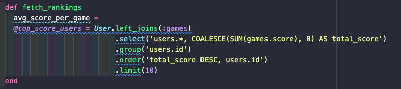

# Lingo Ludus - A Language Learning Game App

### Project description
Motivated by my interest in educational technology, I came up with this idea for a language learning game. It's a full-stack application built using Ruby on Rails and includes a game page with two language options, a dashboard with a chart.js graph, chatrooms using action cable, and dark mode. This was a team project and part of Le Wagon's full-stack web development bootcamp. 

## 📸 Screenshots  

### 🖥️ Desktop View  
  
  
  

### 📱 Mobile View  
 

## 🎯 Aims  
- Build a fun, interactive, and responsive app.  
- Implement an instructions modal.
- Create a wordle-style games page.
- Create a dashboard with leaderboard to track player success and increase conversion rates.
- Add a chatroom where players can communicate with each other.
- Add dark mode and second language options for accessibility and international reach. 

## 🛠️ Challenges & Solutions  

### 💬 Real-time Chatroom with Action Cable  
✅ **Problem:** WebSocket connections were unstable at times, causing messages to **not appear instantly** or requiring page refreshes.  
✅ **Solution:**  
- Used **Redis** as the **Action Cable adapter** for stable WebSocket connections.  
- Ensured **proper channel subscriptions** to broadcast messages instantly.  
- Implemented **Turbo Streams** to dynamically update chat messages in real-time without reloading the page.  

### 📊 Optimizing Leaderboard Queries for Performance  
✅ **Problem:** Fetching top players for the leaderboard involved **inefficient database queries**, leading to slow page loads.  
✅ **Solution:**  
- Used **ActiveRecord’s `.select()` and `.group()`** to fetch only the necessary data.  
- Indexed the **score column** for faster lookups. Without an index, the database must scan the **entire table** to find scores, which slows everything down.

  
  
  
### 🏆 Tracking Recent Game Performance Efficiently  
✅ **Problem:** The dashboard needed to display **recent game data**, but inefficient queries caused slow loading times.  
✅ **Solution:**  
- Used `.order(start_time: :desc).limit(5)` to **fetch only the latest five games**, reducing database strain.  
- Ensured `.reject` was used efficiently to exclude games with `nil` or `Float::INFINITY` durations.
(Some games had invalid times - e.g., games that never ended) -, which could make average time calculations inaccurate. Removing these prevents the leaderboard from being distorted.) 

  

## 🛠 Tech Stack  

### **Frontend:**  
- **HTML, CSS, JavaScript(Stimulus.js)** – Responsive UI with Bootstrap  
- **Chart.js** – Data visualization for dashboard stats  
- **Font Awesome** – Icons for leaderboard and UI enhancements  

### **Backend:**  
- **Ruby on Rails** – Full-stack framework for application logic  
- **Action Cable** – Real-time WebSocket chat functionality  

### **Database & Storage:**  
- **PostgreSQL** – Relational database for storing user data and game history  
- **Redis** – Caching and pub/sub messaging for Action Cable  

### **Deployment:**  
- **Heroku** – Cloud hosting for app deployment   

Rails app generated with [lewagon/rails-templates](https://github.com/lewagon/rails-templates), created by the [Le Wagon coding bootcamp](https://www.lewagon.com) team.
