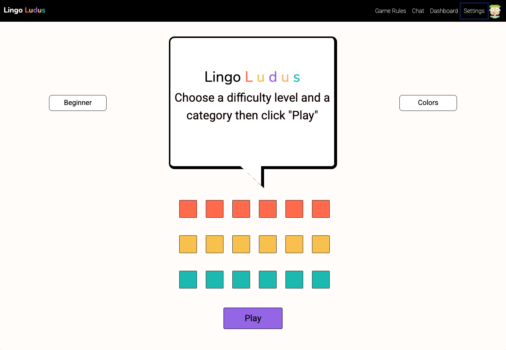
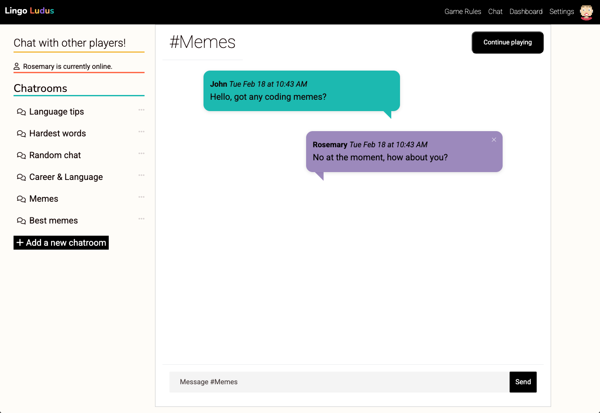
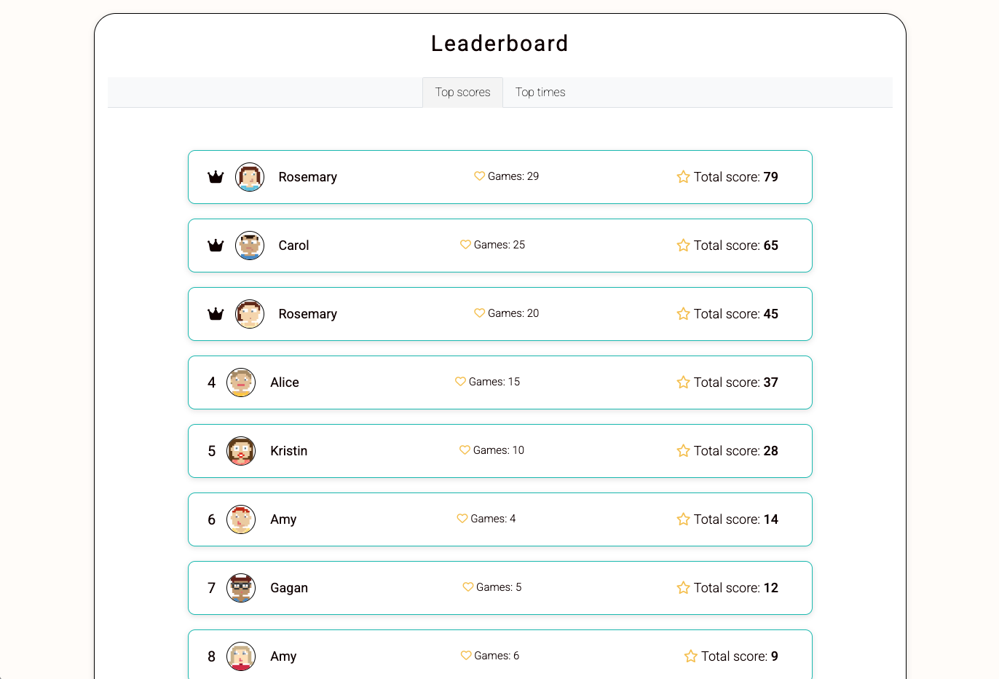
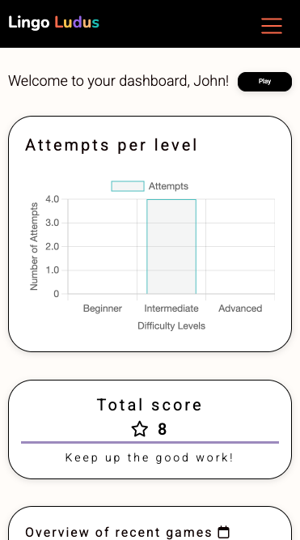
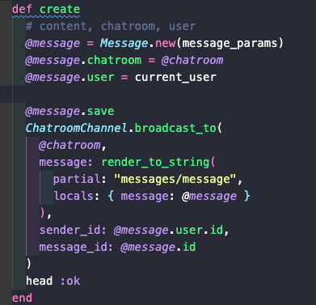
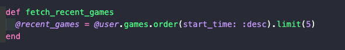

# Lingo Ludus - A Language Learning Game App

🔗 **Live Demo:** [View the Website on Netlify](https://lingoludus-ac98bddb8223.herokuapp.com/)  

### Project description
Motivated by my interest in educational technology, I came up with this idea for a language learning game. It's a full-stack application built using Ruby on Rails and includes a game page with two language options, a dashboard with a chart.js graph, chatrooms using action cable, and dark mode. This was a team project and part of Le Wagon's full-stack web development bootcamp. 

## 📸 Screenshots  

### 🖥️ Desktop View  
  
  
  

### 📱 Mobile View  
 

## 🎯 Aims  
- Build a fun, interactive, and responsive app.  
- Implement an instructions modal.
- Create a wordle-style games page.
- Create a dashboard with leaderboard to track player success and increase conversion rates.
- Add a chatroom where players can communicate with each other.
- Add dark mode and second language options for accessibility and international reach. 

## 🛠️ Challenges & Solutions  

### 🎨 Smooth Homepage Animation with Timed Redirection  
💻 **Problem:** The animation on the homepage needed to appear smoothly and then transition into the game page at the right time. Without proper timing, elements could move abruptly, or the redirect could feel too sudden.  
✅ **Solution:**  
- Used `setTimeout()` to stagger square animations, creating a smooth cascading effect.  
- Calculated the total animation duration dynamically so the redirect only happens after the last square animation ends.  
- Applied a **fade-out effect** before redirecting to `/play` to make the transition more natural.  

### 💬 Real-time Chatroom with Action Cable  
💻 **Problem:** WebSocket connections were unstable at times, causing messages to **not appear instantly** or requiring page refreshes.  
✅ **Solution:**  
- Used **Redis** as the **Action Cable adapter** for stable WebSocket connections.  
- Ensured **proper channel subscriptions** to broadcast messages instantly.  
- Used **Action Cable’s `broadcast_to` method** to send new messages to all users in the chatroom without needing a page reload.

  
 
  
### 🏆 Tracking Recent Game Performance Efficiently  
💻 **Problem:** The dashboard needed to display **recent game data**, but inefficient queries caused slow loading times.  
✅ **Solution:**  
- Used `.order(start_time: :desc).limit(5)` to **fetch only the latest five games**, reducing database strain.  

  

## 🛠 Tech Stack  

### **Frontend:**  
- **HTML, SCSS, JavaScript(Stimulus.js)** – Responsive UI with Bootstrap  
- **Chart.js** – Data visualization for dashboard stats  
- **Font Awesome** – Icons for leaderboard and UI enhancements  

### **Backend:**  
- **Ruby on Rails** – Full-stack framework for application logic  
- **Action Cable** – Real-time WebSocket chat functionality  

### **Database & Storage:**  
- **PostgreSQL** – Relational database for storing user data and game history  
- **Redis** – Caching and pub/sub messaging for Action Cable  

### **Deployment:**  
- **Heroku** – Cloud hosting for app deployment   

## 📞 Contact  

📧 **Email:** rohogarth@email.com  
🔗 **Portfolio:** [https://wondrous-sprite-d950e1.netlify.app/](https://wondrous-sprite-d950e1.netlify.app/)  
💼 **LinkedIn:** [https://www.linkedin.com/in/rosemary-hogarth/](https://www.linkedin.com/in/rosemary-hogarth/)  

Rails app generated with [lewagon/rails-templates](https://github.com/lewagon/rails-templates), created by the [Le Wagon coding bootcamp](https://www.lewagon.com) team.
